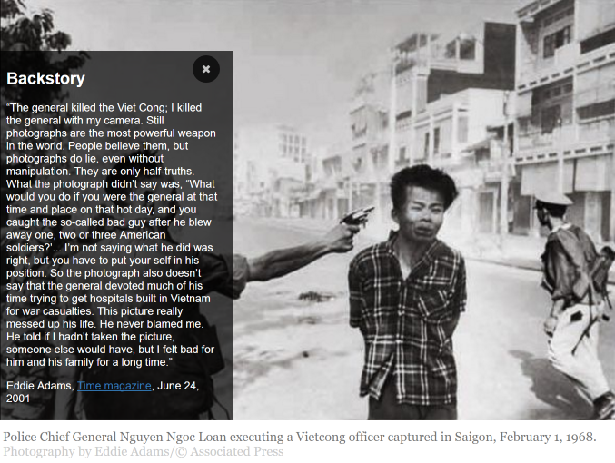

<p align="center">
    
</p>

**Authograph** is a way for photo-journalists and content creators to display a rich visual overlay of metadata onto their web-based images. Announced at World Press Photo Foundation awards ceremony 2016, this simple drop-in javascript library automatically augments seleted photos with additional content, curated by the content owner.

<p align="center">

</p>

See the [Project Site](https://fourcorners.io) for more background on the project and future directions.

[Click Here](https://digitalinteraction.github.io/authograph/docs/) to see a live demo in action.

## Getting Your Site Ready

Using Authograph on your site is as simple is pasting our hosted Javascript link into the bottom of your website page or template.

Just insert the following line at the *end* of your html, as seen below:

`<script src="https://digitalinteraction.github.io/authograph/dist/4c.js"></script>`

```html
<body>
...
...
...
<!-- Insert this line to enable 4C on your site -->
<script src="https://digitalinteraction.github.io/authgraph/dist/4c.js"></script>
</body>
</html>
```

You can host the file yourself, just download the distribution version from this git repository and change the `src` field to match where you place the file.

## Generate Metadata

The Authograph overlay will dynamically adjust to the metadata you have available. 

This data is stored in a `<script>` tag embedded in the page for each image. This is simple JSON following a particular format.

**You can use the [Online Editor](https://digitalinteraction.github.io/authograph-editor) to create and edit your metadata:**

**https://digitalinteraction.github.io/authograph-editor**

If you want to manually create or edit this data (by hand or code), read the [Authograph JSON format](docs/4cjson.md).

## Mark Your Images

For each image that you want to augment with a Authograph overlay, add the `data-4c` attribute:

```html

```

Authograph automatically loads the metadata located in a matching `<script>` tag in the document with an attribute of `data-4c-myfilename`.

----

> Authograph is an open source initiate delivered as part of a collaboration between leading universities and journalist organisations. If you would like to find out more, please contact us directly <info@authograph.org>.  Content imagery used in the demo is photography by Eddie Adams/© Associated Press.
