# Adding Four Corners to your Wordpress Blog

> Please note - you can currently only do this on sites *not* hosted on wordpress.com. A Wordpress plugin will be released that will allow you do this.

Follow the following steps for each image that you want to add Four Corners metadata to:

# Step 1 - Login
Login to Wordpress using your details:

`http://<yoursite>/wp-admin`

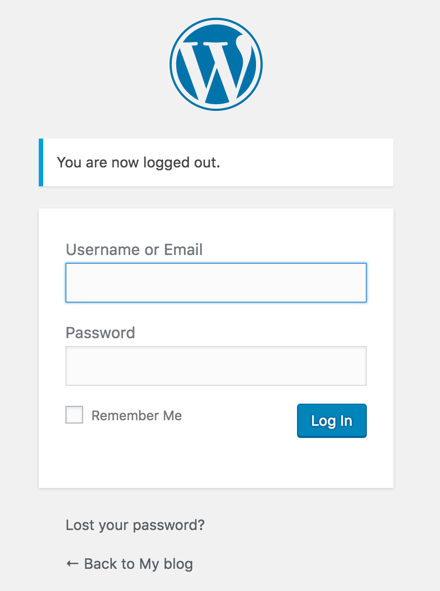

# Step 2 - Prepare Wordpress for Four Corners

To use Four Corners with Wordpress, you have to add an extra line of code. This is very easy.

Go to the `Appearance -> Editor` page:

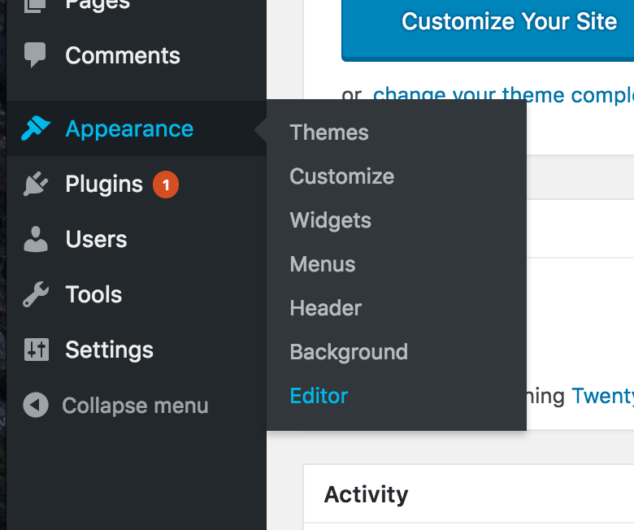

Edit the `Theme Footer`:

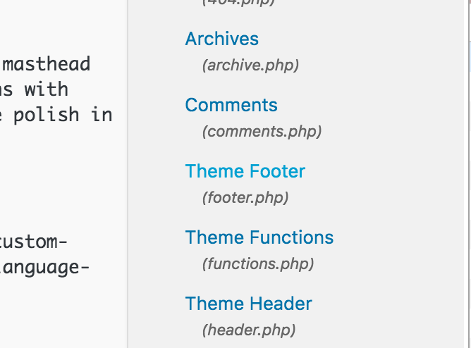

Paste the following code into the Footer file, right above the `</body>` line.

``

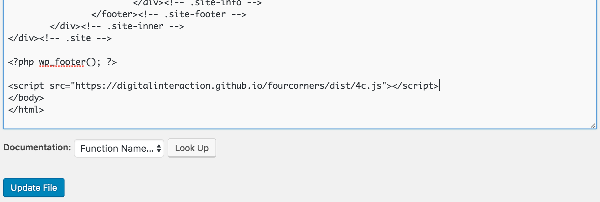

Press `Update File`. You have finished preparing Wordpress.

# Step 3 - Prepare Your Metadata

For each Four Corners enabled image on your site, you will need a *sidecar* metadata file. This is just another file that contains all of the extra metadata you want to display about your image.

Create each file by using the online editor at:

<https://digitalinteraction.github.io/fourcorners-editor/>

Fill in the form:

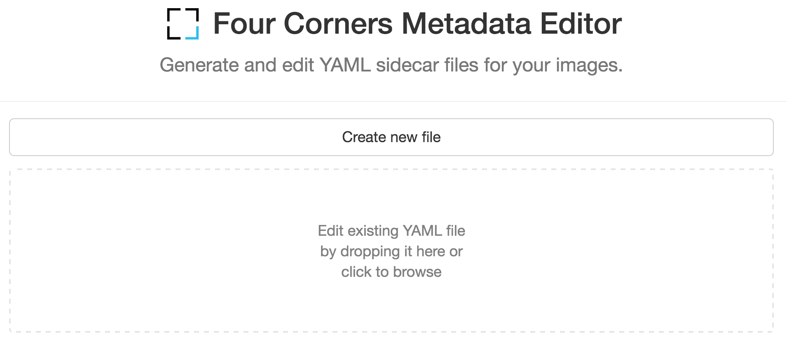

Then download and save the file to your computer.

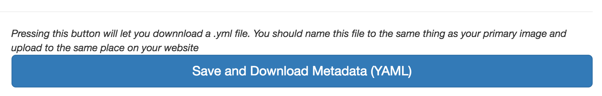

> Sometimes this file might not download, but instead display in your browser. If this happens, just `right-click` and `save as` on your computer.

> If you are using additional images, it may help to upload them to your Wordpress media manager before completing this step, and using the URL's from the media manager in your metadata to avoid missing links. See below about how to get these links.

## At this point, most Wordpress sites won't allow you to upload this `.yaml` file, so we have to rename it. Use whatever is your normal way for renaming files, to add a `.txt` extension.

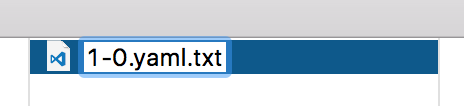
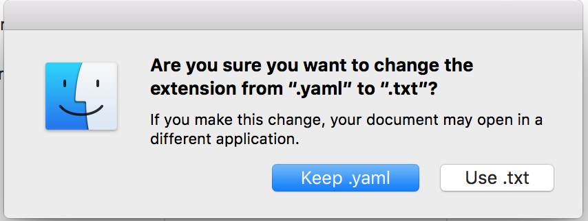

You are now ready to put this metadata on your Wordpress page.

# Step 4 - Add Your Metadata to Wordpress

Now we have both the image file (`.jpg` or `.png`), and the sidecar file (`.txt`). Go to edit the post or page you want the image on.

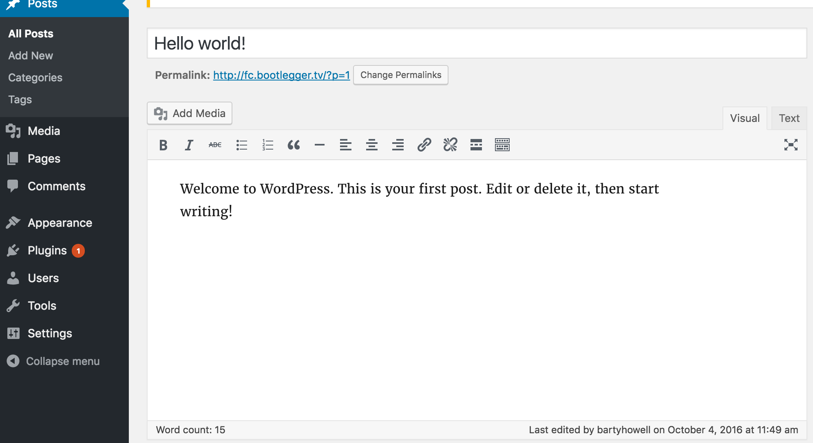

Upload the image:

Add to the post:

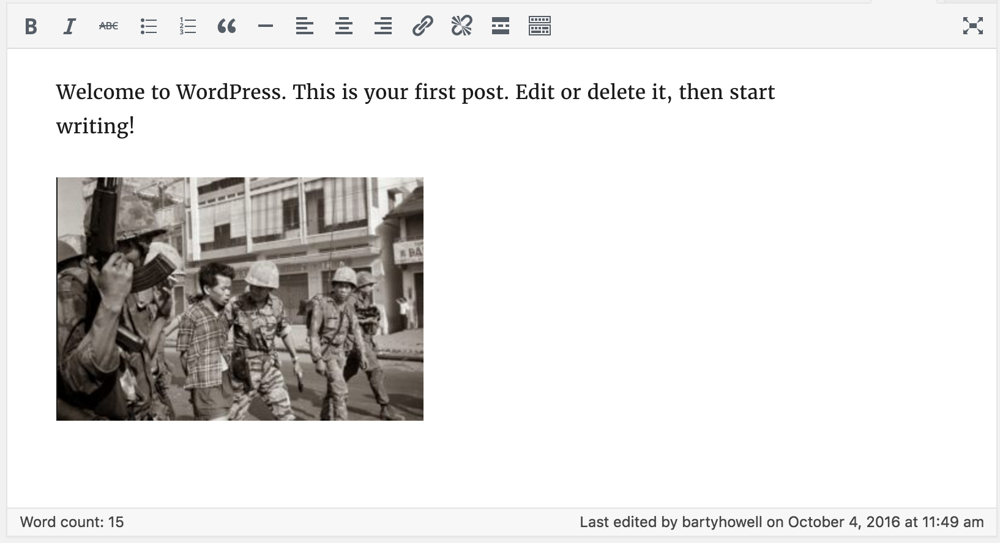

Upload the metadata file in the same way:

Find the link to the metadata file by clicking on the file in the media manager:

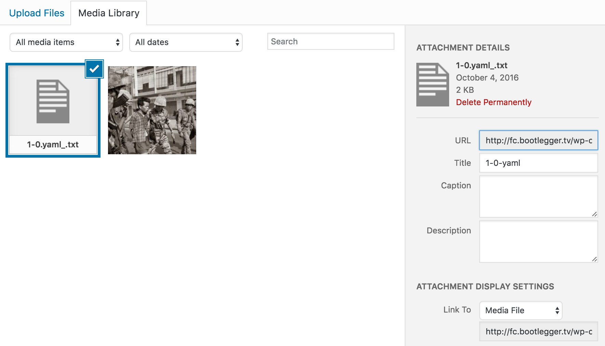

Copy the URL:

Close the media manager (top right)

Turn on `Text` mode (top right of the editor):

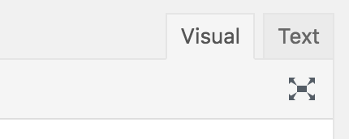

Find the image line, it should look something like this:

> 

Then insert the four corners text:

> 

Where http://myimage.txt is the copied URL for your metadata file, like the example below:

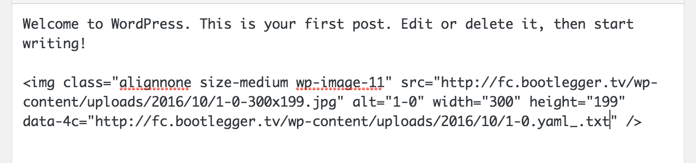

Press `Update` and save your post.

Visiting your page will now augment your image with your metadata when you hover over the corners.

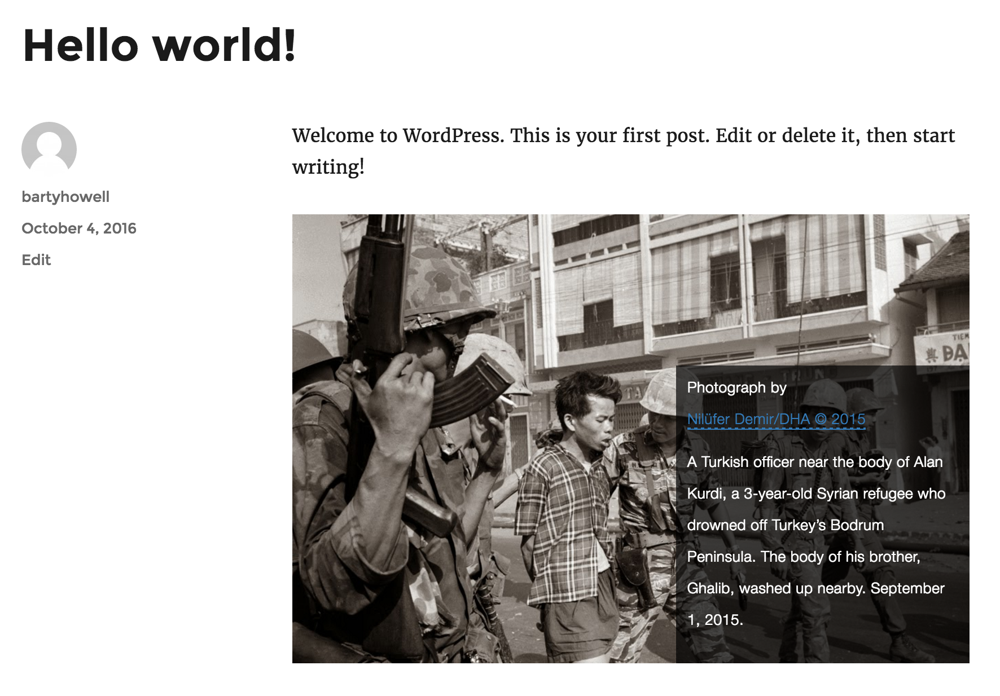